# Wireframe

[^wireframe]

Um wireframe de site web ou website wireframe é um protótipo usado em design de interface para sugerir a estrutura de um sítio web e relacionamentos entre suas páginas. Um wireframe web é uma ilustração semelhante do layout de elementos fundamentais na interface. Normalmente, wireframes são concluídos antes que qualquer trabalho artístico seja desenvolvido, tendo como principal objetivo a navegação e disposição do conteúdo, assim como demonstrar as preferências de um cliente quanto aos requisitos funcionais de um sistema.

Opções de ferramentas para desenvolvimento do Wireframe (ou protótipo) do sistema

## Drawio
- https://drawio-app.com/use-draw-io-to-mockup-your-mobile-apps/
- https://www.blogson.com.br/como-criar-um-wireframe-usando-o-draw-io/
- https://app.diagrams.net/

## Figma

- https://www.figma.com/

## penpot

- https://penpot.app/

## salt
https://plantuml.com/salt

```plantuml
@startsalt
{
  Login    | "MyName   "
  Password | "****     "
  [Cancel] | [  OK   ]
}
@endsalt

```

## Link tarefa 

[https://classroom.github.com/a/w_Y3CyyD](https://classroom.github.com/a/w_Y3CyyD)

<!-- @include: ../bib/bib.md -->