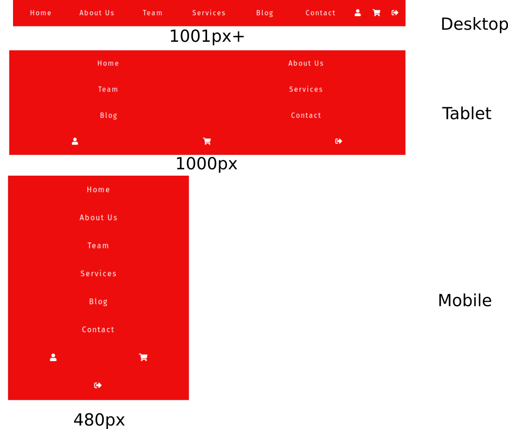

# Flexbox CSS

[^flexbox_nav]

Com CSS Flexbox, é bastante prático codificar uma barra de navegação básica sem a necessidade de usar flutuadores ou cálculos complicados de pixels.

## O Layout





A barra de navegação consiste em uma lista desordenada com 9 links. Existem dois grupos de links. Os primeiros 6 links levam o usuário a diferentes páginas do site. Os últimos 3 são representados por ícones. Eles levam o usuário para sua página de perfil, para o carrinho de compras ou ajuda o usuário a fechar a sessão (na ordem).

O layout tem 3 pontos de interrupção:

- telas mais largas que 1001px – Desktop
- telas de 481px a 1000px – Tablet
- telas mais estreitas do que 480px – Mobile


## Criar o HTML

- Abra o seu editor de código preferido.
- Crie um arquivo HTML.

```html
<!DOCTYPE html>
<html lang="en">
<head>
   <meta charset="UTF-8">
   <meta name="viewport" content="width=device-width, initial-scale=1.0">
   <meta http-equiv="X-UA-Compatible" content="ie=edge">
   <title>Flexbox Navigation</title>
   <link rel="stylesheet" href="style.css">
   <link rel="stylesheet" href="https://cdnjs.cloudflare.com/ajax/libs/font-awesome/5.9.0/css/all.css">
   <link href="https://fonts.googleapis.com/css?family=Fira+Sans&display=swap" rel="stylesheet">
</head>
<body>
   <div class="main">
      <nav class="navigation">
         <ul>
            <li><a href="#">Home</a></li>
            <li><a href="#">About Us</a></li>
            <li><a href="#">Team</a></li>
            <li><a href="#">Services</a></li>
            <li><a href="#">Blog</a></li>
            <li><a href="#">Contact</a></li>
            <li class="user"><a href="#"><i class="fas fa-user"></i></a></li>
            <li class="user"><a href="#"><i class="fas fa-shopping-cart"></i></a></li>
            <li class="user"><a href="#"><i class="fas fa-sign-out-alt"></i></a></li>
         </ul> 
      </nav>
   </div>
</body>
</html>
```

- crie o style.css

```css
/* GLOBAL STYLES */

* {
    box-sizing: border-box;
 }
 
 body {
    font-family: 'Fira Sans', sans-serif;
    margin: 0;
 }

a {
   color: white;
   font-weight: 300;
   letter-spacing: 2px;
   text-decoration: none;
   background: rgb(238, 13, 13);
   padding: 20px 5px;
   display: inline-block;
   width: 100%;
   text-align: center;
}

a:hover {
   background: rgba(238, 13, 13, 0.75);
}

.main {
   max-width: 1200px;
   margin: 0 auto;
   padding: 0 3em 1.5em;
}

.navigation ul {
   border: 1px solid rgb(212, 20, 20);
   list-style: none;
   margin: 0;
   padding: 0;
   display: flex;
}

.navigation li {
   flex: 3;    
}

.navigation .user {
   flex: 1;
}

@media all and (max-width: 1000px) {
   .navigation ul {
      flex-wrap: wrap;
   }
   
   .navigation li {
      flex: 1 1 50%;
   }

   .navigation .user {
      flex: 1 1 33.33%;
   }
}

@media all and (max-width: 480px) {
   .navigation li {
      flex-basis: 100%;
   }

   .navigation .user {
      flex-basis: 50%;
   }
}

```

[CodePen](https://codepen.io/jorgemb76/pen/gNZqjm)


## Referências

<!-- @include: ../bib/bib.md -->

## Links extras

- [https://www.w3schools.com/css/css3_flexbox.asp](https://www.w3schools.com/css/css3_flexbox.asp)
